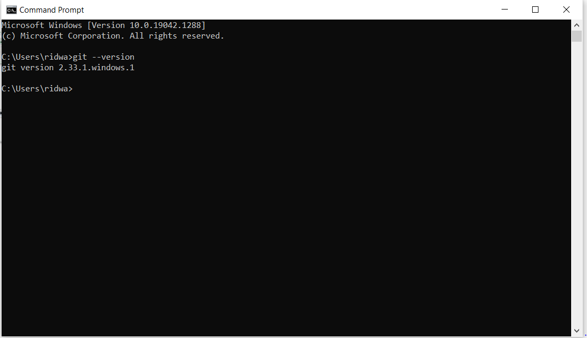

# Download git bash

masuk pada browser ,dan download dulu git bash atau klik [git bash](http://git-scm.com)

# install git bash

setelah terdownload lalu install git bash

lalu akan muncul documen license dari git klik next untuk melanjutkan instalasi

lalu akan muncul komponen tambahan untuk install git

lalu tunggu instalasi berjalan sampai selesai

lalu klik finish setelah instalasi selesai

# cek versi git

buka cmd pada windows

lalu masukan perintah berikut untuk mengecek apakah git sudah terinstall

    $ git --version

jika git sudah berhasil terinstall, maka akan muncul tampilan seperti dibawah ini

# MEMBUAT REPOSITORY

buka github pada browser atau klik [github](www.github.com)

# login github

setelah masuk ke git akan keluar tampilan berikut ini

apabila sudah memiliki akun langsung sign in pada github masukan username dan password github .lalu klik sign in

# membuat repository baru

setelah berhasil login github ,lalu membuat repository . klik tombol new pada menu repoositories untuk membuat repository baru

lalu isi nama, deskripsi, dan jenis repository , lalu centang add README.md setelah selesai mengisi lalu klik create

# buat folder pada windows

selanjutnya buat folder baru pada local disk komputer untuk menyimpan update file dari repository yang telah dibuat

# buka folder menggunakan git bash

klik kanan pada folder yang telah dibuat . lalu klik git bash here

lalu akan muncul tampilan dibawah ini

# clone repository
masuk ke repository pada github lalu klik code

dan salin alamat repository seperti pada gambar berikut

lalu masuk ke git bash lagi . dan masukann perintah berikut

    $ git clone salinan dari url repository

lalu akan muncul tampilan berikut

# rubah folder menjadi repository
lakukan perintah berikut agar folder menjadi repository

    $ cd nama repository

lalu akan muncul tampilan sebagai berikut

# menambahkan file
pada git bash masukan perintah berikut

    $ git add .

lalu akan muncul tampilan berikut

# buat commit
commit berfungsi menambahkan komentar pada file yang baru diupload. masukan perintah berikut untuk membuat commit

    $ git commit -m"masukan coommit"

kalian bebas memasukan nama commit .

# push ke github
masukan perintah berikut untuk push ke github

    $ git push -u origin main

jika proses berhasil akan muncul tampilan sebagai berikut

# cek pekerjaan
masuk ke github dan cek apakah pekerjaan sudah selesai

terimakasih

